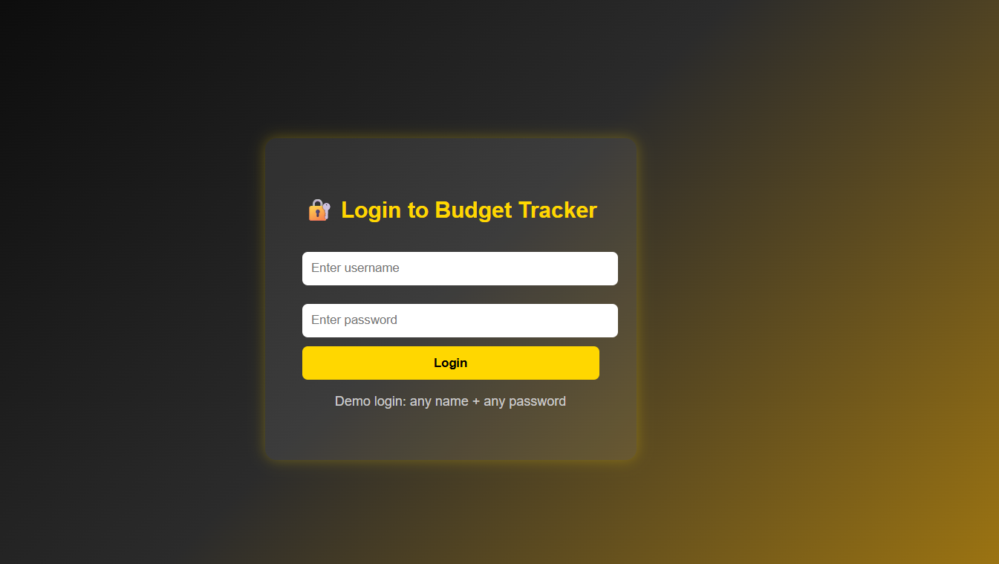
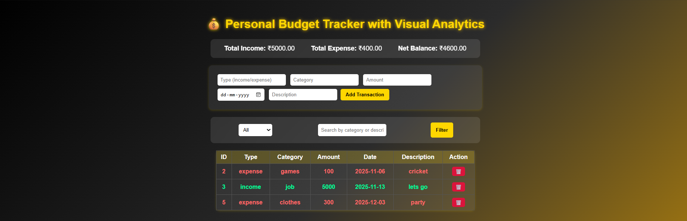
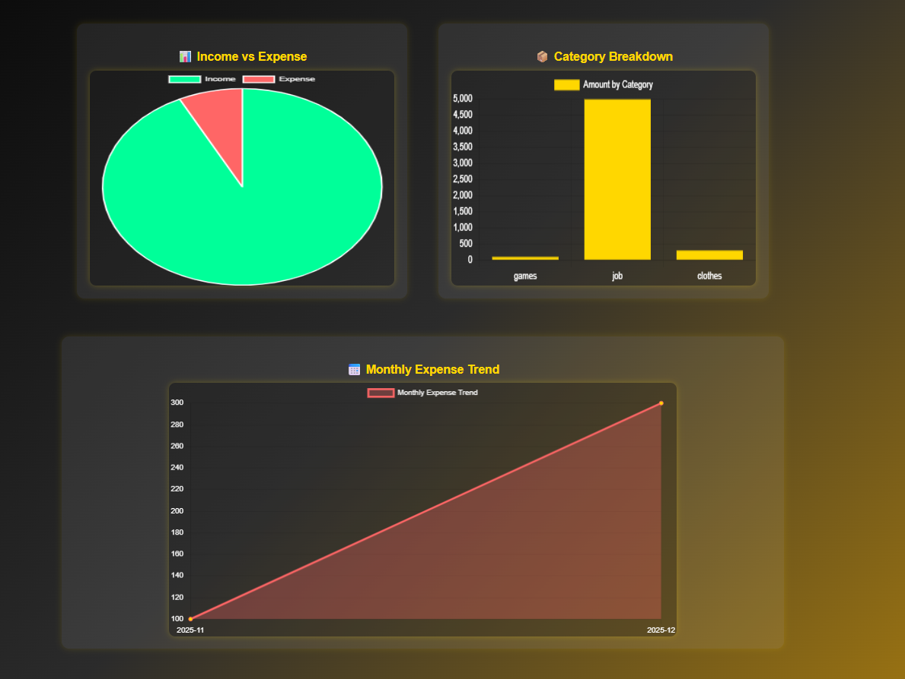

# 💰 Personal Budget Tracker with Visual Analytics

A web-based financial management system built using **Spring Boot**, **MySQL**, and **Chart.js**.  
It helps users track their income, expenses, and savings visually through interactive charts.

---
🔗 **Live Demo:** [Budget Tracker](https://rajdeepsingh2.github.io/Budget-Tracker/)

## 🚀 Features

- ➕ Add, view, and delete transactions  
- 💹 Summary bar showing total income, expense, and net balance  
- 🔍 Filter and search by category or type  
- 📊 Visual analytics with:
  - Pie chart (Income vs Expense)
  - Bar chart (Category-wise breakdown)
  - Line chart (Monthly expense trend)
- 🧾 Fully connected backend (Spring Boot + MySQL)
- 🌐 Responsive and modern UI using HTML, CSS, and JavaScript

---

## 🧩 Tech Stack

| Layer | Technology |
|:------|:------------|
| **Frontend** | HTML, CSS, JavaScript, Chart.js |
| **Backend** | Spring Boot (Java) |
| **Database** | MySQL |
| **API Testing** | Postman |
| **Version Control** | Git & GitHub |

---
**LOGIN PAGE**

**HOME PAGE**

**GRAPHS**

## ⚙️ Installation & Setup

1. **Clone the repository**
   
   git clone https://github.com/<your-username>/Personal-Budget-Tracker.git
   
2.**Backend Setup**

Open the project in VS Code or IntelliJ

Configure your MySQL credentials in
src/main/resources/application.properties

3.**Run:**

mvn spring-boot:run

4.**Frontend Setup**

Open frontend/index.html in a browser

The app connects automatically to your backend on port 8080
